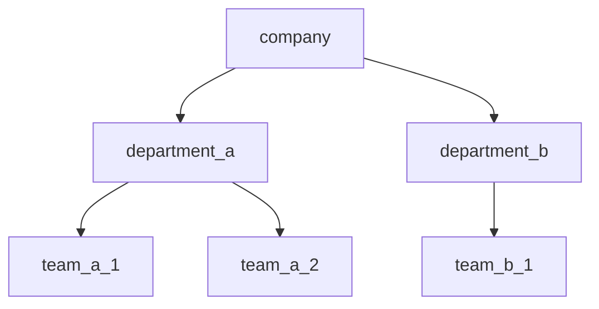

# Fluff

## Hierarchical Data Structure

- data is represented as a hierarchy
- when accessing a node you use a path starting from the root to the node that you want access to.

- for example, suppose we define a structure that looks like above. if we wanted to get access to data on the **team_a_1 node**, we would use a path that below...

```
{company}.{department_a}.{team_a_1}
```
  - if we pass this path to the **get** method to the **Fluff Builder** (plus other required values to be discussed later) we would get back a json object that has all fields set on the object. 
  - the JSON you got back might look like following...
  ```json
 // Path: {company}.{department_a}.{team_a_1}
  {
	  "id":"team_a_1",
	  "name":"Team A1",
  }
  ```
  - to get the **Department A** JSON, we would write the path below....
  ```json
 // Path: {company}.{department_a}
  {
	  "id":"department_a",
	  "name":"Department A",
  }
  ```

-    notice that each of the nodes is surrounded by **curly brackets** and separated by a **period**.
-    let's suppose you wanted to just get the name of Department A, you would add a ".name" to the end of the path.

  ```json
 // Path: {company}.{department_a}.name
  {
	  "name":"Department A",
  }
  ```

## Updating Values
### How do you add values to the fluff.
- you add values to full by calling the **set** method, passing in the path and value.
```javascript
// some parameters not included for the sudo code
fluff.set("{company}.{department_a}.{team_a2}.name", "Team A1");
```
> **rule:** the set method path must end in a field (ex. *.name*), not an object (ex.  *{team_a2}*)

- to build our fluff structure out lined above, the following paths and values were used.

 | Path | Value | 
 |-- | --| 
| {company}.name| Company |
|  {company}.{department_a}.name  | Department A |
|  {company}.{department_b}.name  | Department B |
|  {company}.{department_a}.{team_a1}.name | Team A1 |
|  {company}.{department_a}.{team_a2}.name | Team A2 |
|  {company}.{department_a}.{team_b1}.name | Team B1 |

### Adding a new value


|  Id | Name| 
|-- | --|
| company | Company |
|  department_a  | Department A |
|  department_b  | Department B |
|  team_a1 | Team A1 |
|  team_a2 | Team A2 |
|  team_b1 | Team B1 |


- Data changes in parents automatically get propagated to children.


|  |company | department_a | department_b  |  team_a1 |  team_a2 | team_b1 |
|--|--|--|--|--|--|--|
| name  |Company| Department A | Department B  |  Team A1 |  Team A2 | Team B1 |

