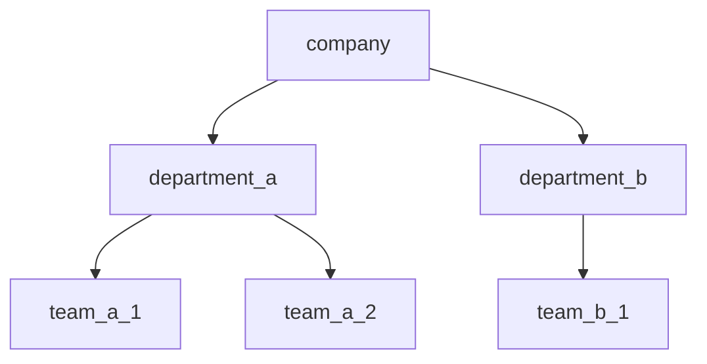
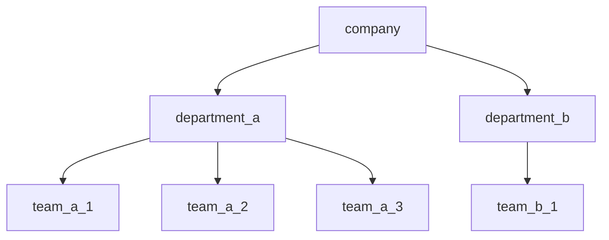

# Fluff

## Hierarchical Data Structure

Fluff data is represented as a hierarchy.

When accessing a node you use a path starting from the root to the node that you want access to.



For example, suppose we define a structure that looks like above. If we wanted to get access to data on the **team_a_1 node**, we would use a path that below...

```
{company}.{department_a}.{team_a_1}
```
If we pass this path to the **get** method to the **Fluff Builder** (plus other required values to be discussed later) we would get back a json object that has all fields set on the object. 

The JSON you got back might look like following...

  ```json
 // Path: {company}.{department_a}.{team_a_1}
  {
	  "id":"team_a_1",
	  "name":"Team A1",
  }
  ```
  - to get the **Department A** JSON, we would write the path below....
  ```json
 // Path: {company}.{department_a}
  {
	  "id":"department_a",
	  "name":"Department A",
  }
  ```

Notice that each of the nodes is surrounded by **curly brackets** and separated by a **period**.

Let's suppose you wanted to just get the name of Department A, you would add a ".name" to the end of the path.

  ```json
 // Path: {company}.{department_a}.name
  {
	  "name":"Department A",
  }
  ```

## Updating Values
### How do you add values to the fluff.
- you add values to full by calling the **set** method, passing in the path and value.
```javascript
// some parameters not included for the sudo code
fluff.set("{company}.{department_a}.{team_a2}.name", "Team A1");
```
> **rule:** the set method path must end in a field (ex. *.name*), not an object (ex.  *{team_a2}*)

- to build our fluff structure out lined above, the following paths and values were used.

 | Path | Value | 
 |-- | --| 
| {company}.name| Company |
|  {company}.{department_a}.name  | Department A |
|  {company}.{department_b}.name  | Department B |
|  {company}.{department_a}.{team_a1}.name | Team A1 |
|  {company}.{department_a}.{team_a2}.name | Team A2 |
|  {company}.{department_a}.{team_b1}.name | Team B1 |

### Adding a new value

- currently our data saved in full can be represented by the following table.

|  Id | Name| 
|-- | --|
| company | Company |
|  department_a  | Department A |
|  department_b  | Department B |
|  team_a1 | Team A1 |
|  team_a2 | Team A2 |
|  team_b1 | Team B1 |

We want to add a new field **numberEmployees** with the value of *5* to team_a1. To do this, we would send the Fluff set() method following values.

 | Path | Value | 
 |-- | --| 
|  {company}.{department_a}.{team_a1}.numberEmployees | 5 |


Our data would now look like this...

|  id | name| numberEmployees |
|-- | --| -- |
| company | Company |  |
|  department_a  | Department A |  |
|  department_b  | Department B |  |
|  team_a1 | Team A1 | 5 |
|  team_a2 | Team A2 |  |
|  team_b1 | Team B1 |  |

To update the A2 team...

 | Path | Value | 
 |-- | --| 
|  {company}.{department_a}.{team_a2}.numberEmployees | 20 |

Our data now looks like this...

|  id | name| numberEmployees |
|-- | --| -- |
| company | Company |  |
|  department_a  | Department A |  |
|  department_b  | Department B |  |
|  team_a1 | Team A1 | 5 |
|  team_a2 | Team A2 | 20 |
|  team_b1 | Team B1 |  |

Now lets suppose we want to add a new field **region** to the departments. Department A is in Canada. Department B is in Brazil.

We would send the following two updates...

 | Path | Value | 
 |-- | --| 
|  {company}.{department_a}.region | Canada |
|  {company}.{department_b}.region | Brazil |

Our data now looks like this...

|  id | name| numberEmployees | region
|-- | --| -- | -- |
| company | Company |  |  |
|  department_a  | Department A |  | Canada |
|  department_b  | Department B |  | Brazil |
|  team_a1 | Team A1 | 5 | Canada |
|  team_a2 | Team A2 | 20 | Canada |
|  team_b1 | Team B1 |  | Brazil |

Notice that the teams have automatically inherited their departments region.

Let us see what happens when we add a new team to Department A. 




We can do this by using the following path and value.

 | Path | Value | 
 |-- | --| 
|  {company}.{department_a}.{team_a_3} | Team A3 |

|  id | name| numberEmployees | region
|-- | --| -- | -- |
| company | Company |  |  |
|  department_a  | Department A |  | Canada |
|  department_b  | Department B |  | Brazil |
|  team_a1 | Team A1 | 5 | Canada |
|  team_a2 | Team A2 | 20 | Canada |
|  team_a3 | Team A3 |  | Canada |
|  team_b1 | Team B1 |  | Brazil |

Notice that Team 3 automatically inherits the Canada region.